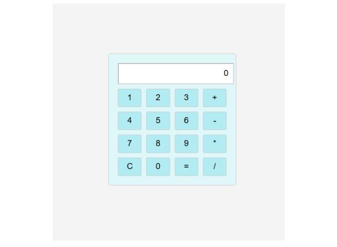

📱 Calculadora Simples

 🛠️ Funcionalidades
Adicionar números ao display
Inserir operações matemáticas (+, -, *, /)
Prevenir inserção de operações inválidas
Calcular e exibir o resultado corretamente
Bloquear divisão por zero, exibindo uma mensagem de erro
Limpar o display

 🛠️ Como usar
Digite um número
Escolha uma operação (+, -, *, /)
Digite outro número
Pressione = para calcular o resultado
Use C para limpar o display

🛠️ Tecnologias usadas
HTML para a estrutura
CSS para o design
JavaScript para a lógica da calculadora

Esse é o resultado visual:

🔹 Teste a calculadora em ação: [CalculadoraJS](https://blendagsantos.github.io/CalculadoraJS/)

